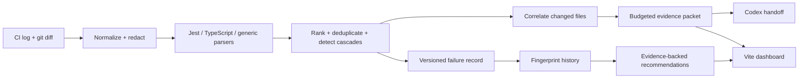

# SignalCI

**SignalCI turns failed CI logs and a commit diff into a compact, cited evidence packet for coding agents—then learns across runs to recommend better engineering workflows.**

[Repository](https://github.com/Dannyso05/CISignal) · **Hosted dashboard:** production URL pending the first Vercel alias

> Demonstration metrics below were measured on the included synthetic fixture. They are not production benchmarks.

| Included fixture | Measured result |
| --- | ---: |
| Raw CI transcript | 72,418 lines / 1,205,770 estimated tokens |
| SignalCI agent packet | 481 estimated tokens |
| Context reduction | 99.96% |
| Primary evidence | raw lines 42,002–42,010 |
| Golden checks | 17 unit/integration assertions plus deterministic demo verification |

SignalCI accelerates failure triage and agent repair loops; it does not make CI test execution itself faster.

## Three-command quickstart

Requires Node.js 20 or newer. The demo is pinned to seed `20260823`.

```bash
npm ci
npm run demo:generate -- --seed 20260823
npm run demo
```

Open the local URL printed by Vite. The dashboard starts with bundled synthetic data and accepts a SignalCI `report.json` via drag-and-drop. Imported reports stay in the browser and are not uploaded.

To verify everything without starting a server:

```bash
npm run build
npm run lint
npm test
npm run demo:generate -- --seed 20260823
npm run demo:verify
npm run dashboard:build
```

## Architecture



The live triage pipeline and historical insights share the same versioned `FailureRecord`; they are not separate mock applications.

## Analyze a local failure

```bash
npm run signalci -- analyze \
  --logs fixtures/noisy-jest-run/ci.log \
  --diff fixtures/noisy-jest-run/commit.diff \
  --run-id demo-run-001 \
  --repository Dannyso05/CISignal \
  --token-budget 2000 \
  --output-dir work/demo-run
```

Generated artifacts:

```text
work/demo-run/report.json          structured failure record
work/demo-run/context.md           bounded agent packet
work/demo-run/summary.md           human-readable summary
work/demo-run/history-record.json  ingestible history unit
```

The fixture is synthetic and models an expiry-boundary regression: `src/auth/token.ts` changes `<=` to `<`, a Jest assertion expects `401` but receives `200`, later auth-fixture failures cascade, and a generic exit arrives last.

## What the analyzer does

1. Preserves raw, one-based line indices while stripping ANSI, timestamps, progress noise, and runner-specific path prefixes from normalized values.
2. Parses Jest assertions, TypeScript compiler errors, and conservative generic errors.
3. Collapses normalized duplicates and groups only reasonable downstream cascade candidates.
4. Scores candidates with inspectable constants. Specific assertions and compiler errors rank above generic exits.
5. Parses unified diffs and labels matching changes as **likely related**, never as proven causes.
6. Creates a stable SHA-256 fingerprint after removing timestamps, UUIDs, paths, source positions, addresses, and random numeric suffixes.
7. Selects exact evidence under a strict estimated-token budget using the documented MVP estimator `ceil(characters / 4)`.

The report keeps facts and inferences distinguishable. Every primary conclusion maps back to raw log lines, and limitations remain visible.

## Historical insights

`FailureStore` abstracts persistence; the MVP uses atomic file-backed JSON writes and never stores complete raw logs by default.

```bash
npm run signalci -- history ingest work/demo-run/history-record.json --store data/history
npm run signalci -- history insights --store data/history --output work/insights.json
```

Deterministic rules identify recurring fingerprints, potential flakes from fail-then-pass evidence, cheap deterministic checks running late, shared-fixture cascade hotspots, and dependency/registry instability.

Every recommendation includes supporting run IDs, confidence, an action, methodology where impact is estimated, and caveats. SignalCI analyzes the CI system—not individual engineers.

## GitHub Actions demonstration

The repository includes three workflows:

- `Verify` proves a clean checkout can build, test, regenerate, verify, and bundle the dashboard.
- `Demo CI` manually runs one deliberately failing synthetic scenario and uploads the complete transcript even after failure.
- `SignalCI Triage` runs after a failed `Demo CI`, downloads the transcript with only `actions: read` and `contents: read`, produces the standard artifacts, validates the report, and writes a GitHub job summary.

From the GitHub **Actions** tab, run **Demo CI** and choose `expired-token`, `fixture-cascade`, or `typescript-error`. The failed conclusion is intentional and triggers the follow-up triage workflow.

The optional direct GitHub adapter is read-only:

```bash
GH_TOKEN=... npm run signalci -- github analyze \
  --repository owner/repository \
  --run-id 123456 \
  --base-sha def456 \
  --head-sha abc123 \
  --output-dir work/github-run
```

It requests only failed/timed-out job logs and the commit diff. Never place a token in a fixture, frontend variable, job summary, or repository-controlled test process.

## Codex handoff

The deterministic analyzer has no required OpenAI API call. Generate a bounded, human-controlled handoff with:

```bash
npm run signalci -- diagnose \
  --report work/demo-run/report.json \
  --output-dir work
```

SignalCI writes `work/codex-prompt.md` and prints an explicit non-interactive Codex command using a workspace-write sandbox and `schemas/codex-result.schema.json`. It does not silently start an agent, push a patch, open a pull request, or expose credentials.

## Dashboard and deployment

The static Vite/React dashboard provides:

- `/run/demo-run-001` — likely origin, exact evidence, related diff, cascade timeline, and packet preview,
- `/insights` — category distribution, fingerprint recurrence, potential-flake evidence, and prioritized recommendations,
- `/methodology` — scoring, token estimation, and claim boundaries,
- client-side `report.json` validation and import.

Vercel reads the checked-in [`vercel.json`](vercel.json):

```text
Install command: npm ci
Build command: npm run dashboard:build
Output directory: dashboard/dist
Production branch: main
```

No backend, database, webhook, API key, or custom domain is required. Route rewrites make direct URL refreshes work.

## Security model

- Redacts likely bearer tokens, GitHub/OpenAI-style keys, cloud credential formats, password assignments, authorization headers, and private-key blocks before persistence or agent handoff.
- Treats logs, diffs, filenames, and error messages as untrusted data.
- Never executes commands extracted from logs.
- Derives reproduction commands only from known framework patterns and marks them unverified until run.
- Persists normalized records and bounded evidence spans, not complete logs.
- Keeps frontend JavaScript free of GitHub, Vercel, and OpenAI secrets.

## Repository map

```text
src/                 analyzer, parsers, scoring, packing, history, integrations
dashboard/           static React dashboard and bundled generated demo data
demo/                fixed-seed generator, manifest, and golden verification
fixtures/            synthetic noisy log, diff, expected result, history records
schemas/             report and Codex-result JSON schemas
tests/               deterministic unit, integration, and golden fixture tests
.github/workflows/   verification, deliberate failure, and follow-up triage
```

## Known limitations

- Jest and TypeScript receive the strongest structured support; generic parsing is intentionally conservative.
- Cascade detection and diff correlation are heuristics and do not establish causation.
- The token estimator is an MVP approximation, not tokenizer output.
- Historical demo records are synthetic and clearly labeled.
- The GitHub adapter analyzes completed logs; it is not a multi-provider CI ingestion service.
- Codex patch generation and verification remain explicit, separately recorded actions.

## License

[MIT](LICENSE)
